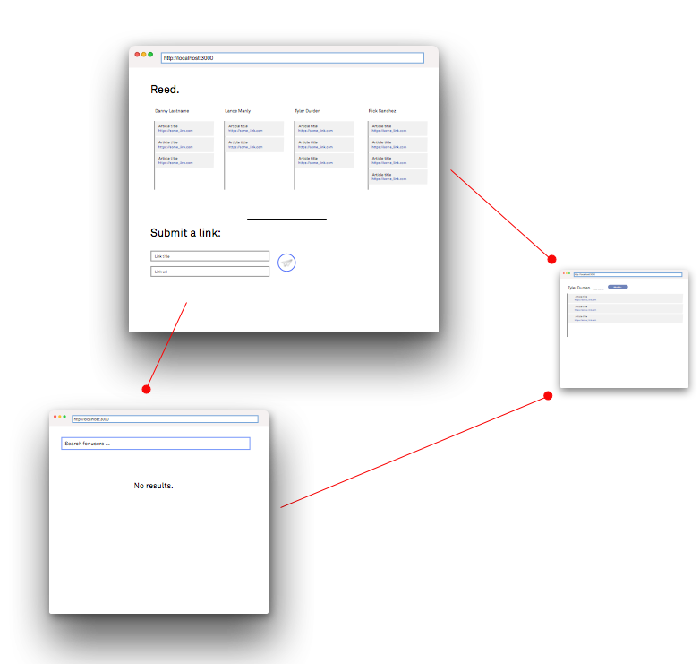

# Reed

## Overview
Recently, I've found myself reading a lot of articles online from a wide array of sites and publications. In the wake of a sudden sprawl to learn more about our poltical system, online privacy, web security and other topics, I consistently wonder what my friends are reading.

Unfortunately, people don't share as liberally on Facebook as they used to, so that's where `Reed` comes in. `Reed` is an social reading list that allows you to, while surfing the web, add articles to a `Daily Reading List`, which in turn populates your followers feeds. You follow people whose readings lists you'd like to see, and people follow you if they want to see what you're reading.


## Data Model

The application will store Users, Lists and Articles

* users have one list (via references)
* each list can have multiple items (by embedding)

Below are the schemas for the 3 models:

User

```javascript
module.exports = mongoose.model('User', new Schema({
    guid: String,
    name: String,
    following: [],
    followers: [],
    followRequests: [],
    password: String,
    admin: Boolean
}));
```

List with Embedded Articles:

```javascript
module.exports = mongoose.model('List', new Schema({
    user_guid: String, //associated with user
    listTitle: String,
    date: String, //date for the lsit
    articles: [] //object array of articles
}));
```
## [First Draft User Schema](server/models/user.js)
## [First Draft List Schema](server/models/list.js)

## Wireframes

/dashboard/ - Main dashboard, populated by the reading lists of the users you follow on Reed.


/you - Profile page


/search - Search page


NOTE: Designs in wireframes are far from final

## Site map



NOTE: More pages may be added in the process of development

## User Stories or Use Cases

1. as non-registered user, I can register a new account with the site
2. as a user, I can log in to the site
3. as a user, I can create a new reading list for other users to see
4. as a user, I can view the reading lists of other people that I follow
5. as a user, I can add items to my daily reading list
6. as a user, I can request to follow other users on the platform
7. as a user, I can ignore follow requests from other users on the platform
8. as a user, I can click through links on my dashboard to read articles

## Research Topics

* (1 points) Integrate user authentication
    * I'm going to be using bcrypt hashing and JSON Web Tokens for authentication.
   
* (4 points) Will be using a Front-End JavaScript framework to handle View Layer (Either Vue.js or Angular)
* (3 points) gulp.js and Browserify (or something else more modern for hot-reload)
    * Will be using gulp for task automation and something like Browserify to have hot reloading and to learn more about workflow.
* (1 points) Will be designing the UI using Sketch 3
* (2 points) Will be adding social features like followers, along with the ability to send and ignore follow requests.

11 points total out of 8 required points.

## [Link to Initial Main Project File](server/server.js)


## Annotations / References Used
1. [scotch.io auth tutorial with JSON Web Tokens](https://scotch.io/tutorials/authenticate-a-node-js-api-with-json-web-tokens) - [auth.js](server/routes/auth.js)
