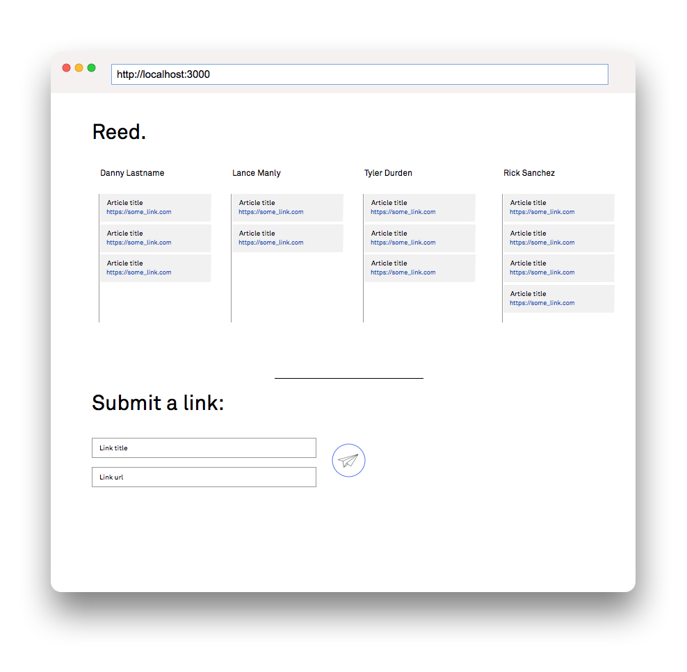
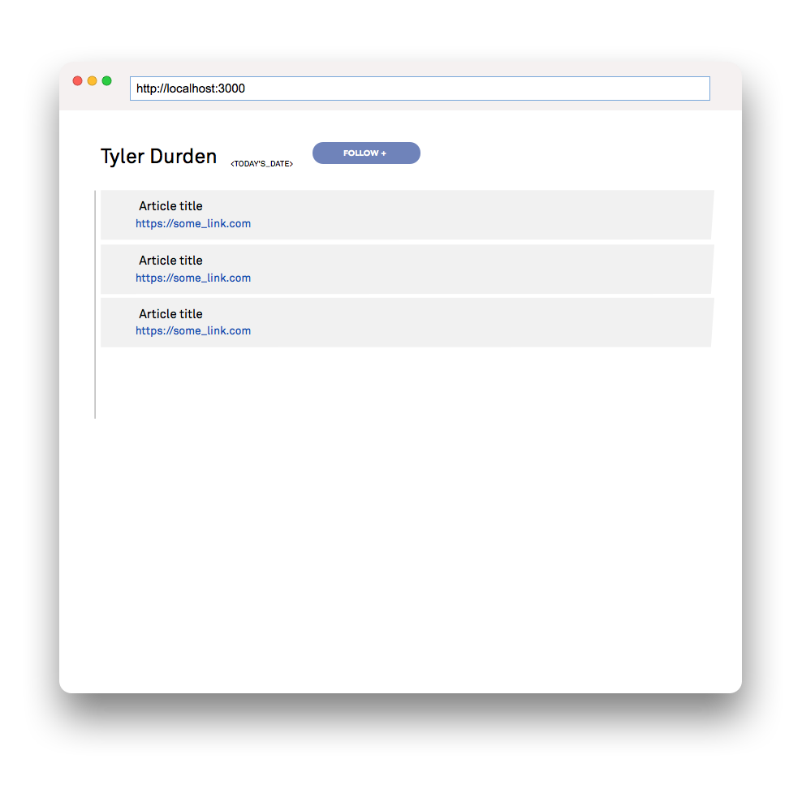
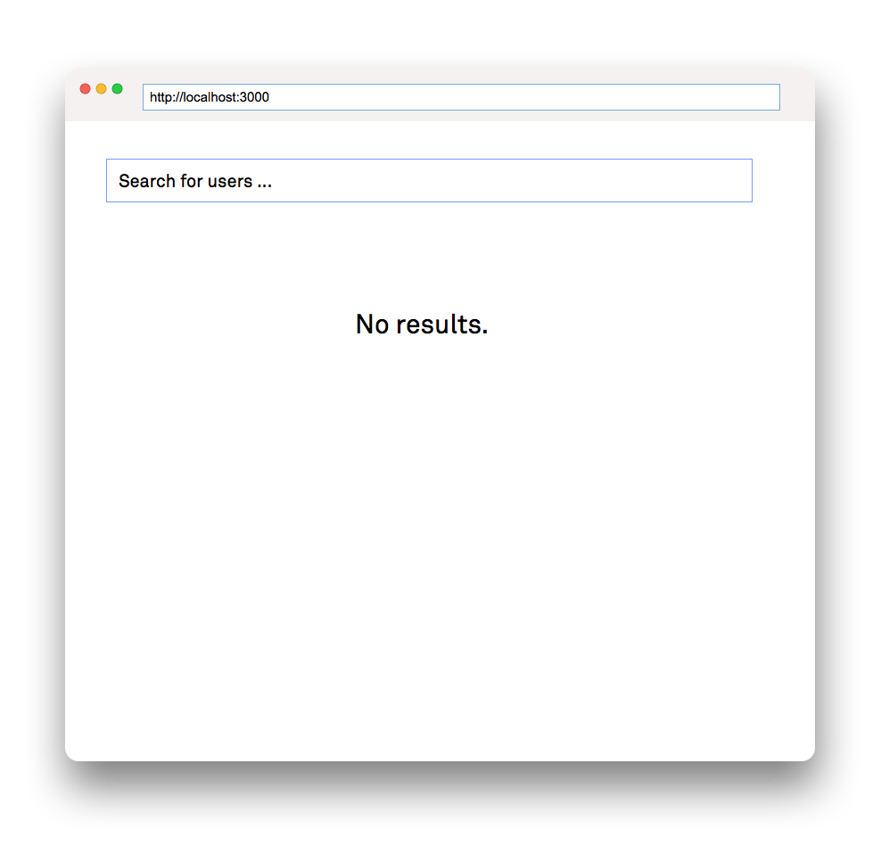

# Reed

## Overview
Recently, I've found myself reading a lot of articles online from a wide array of sites and publications. In the wake of a sudden sprawl to learn more about our poltical system, online privacy, web security and other topics, I consistently wonder what my friends are reading.

Unfortunately, people don't share as liberally on Facebook as they used to, so that's where `Reed` comes in. `Reed` is an social reading list that allows you to, while surfing the web, add articles to a `Daily Reading List`, which in turn populates your followers feeds. You follow people whose readings lists you'd like to see, and people follow you if they want to see what you're reading.


## Data Model

The application will store Users, Lists and Articles

* users have one list (via references)
* each list can have multiple items (by embedding)

Below are the schemas for the 3 models:

User

```javascript
module.exports = mongoose.model('User', new Schema({
    guid: String,
    name: String,
    following: [],
    followers: [],
    followRequests: [],
    password: String,
    admin: Boolean
}));
```

List with Embedded Articles:

```javascript
module.exports = mongoose.model('List', new Schema({
    user_guid: String, //associated with user
    listTitle: String,
    date: String, //date for the lsit
    articles: [] //object array of articles
}));
```
## [First Draft User Schema](server/models/user.js)
## [First Draft List Schema](server/models/list.js)

## Wireframes

/dashboard/ - Main dashboard, populated by the reading lists of the users you follow on Reed.



/you - Profile page



/search - Search page


## Site map

(___TODO__: draw out a site map that shows how pages are related to each other_)


## User Stories or Use Cases

(___TODO__: write out how your application will be used through [user stories](http://en.wikipedia.org/wiki/User_story#Format) and / or [use cases](https://www.mongodb.com/download-center?jmp=docs&_ga=1.47552679.1838903181.1489282706#previous)_)

1. as non-registered user, I can register a new account with the site
2. as a user, I can log in to the site
3. as a user, I can create a new grocery list
4. as a user, I can view all of the grocery lists I've created in a single list
5. as a user, I can add items to an existing grocery list
6. as a user, I can cross off items in an existing grocery list

## Research Topics

(___TODO__: the research topics that you're planning on working on along with their point values... and the total points of research topics listed_)

* (5 points) Integrate user authentication
    * I'm going to be using passport for user authentication
    * And account has been made for testing; I'll email you the password
    * see <code>cs.nyu.edu/~jversoza/ait-final/register</code> for register page
    * see <code>cs.nyu.edu/~jversoza/ait-final/login</code> for login page
* (4 points) Perform client side form validation using a JavaScript library
    * see <code>cs.nyu.edu/~jversoza/ait-final/my-form</code>
    * if you put in a number that's greater than 5, an error message will appear in the dom
* (5 points) vue.js
    * used vue.js as the frontend framework; it's a challenging library to learn, so I've assigned it 5 points

10 points total out of 8 required points (___TODO__: addtional points will __not__ count for extra credit_)


## [Link to Initial Main Project File](app.js)

(___TODO__: create a skeleton Express application with a package.json, app.js, views folder, etc. ... and link to your initial app.js_)

## Annotations / References Used

(___TODO__: list any tutorials/references/etc. that you've based your code off of_)

1. [passport.js authentication docs](http://passportjs.org/docs) - (add link to source code that was based on this)
2. [tutorial on vue.js](https://vuejs.org/v2/guide/) - (add link to source code that was based on this)
